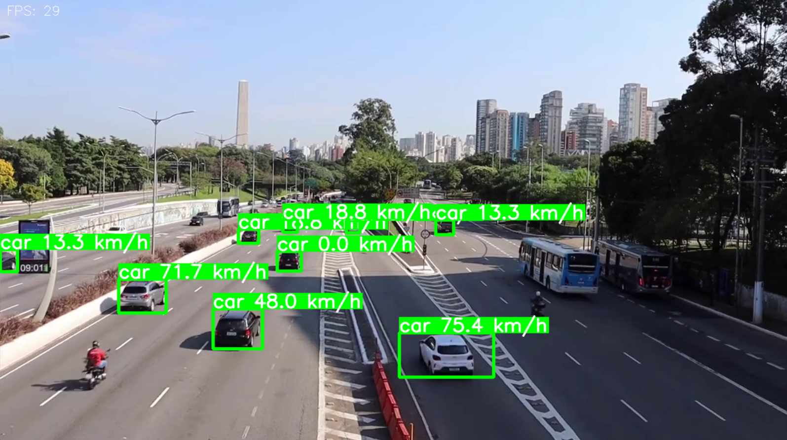

# 🚗 Car Speed Estimation with YOLOv8

Projeto académico de Visão Computacional com Python, que utiliza o modelo **YOLOv8** para **detetar e rastrear carros** num vídeo previamente gravado, e estima a **velocidade de cada carro em km/h** com base na variação da posição entre frames.

---

## 🎯 Objetivos

- Detetar **apenas carros** num vídeo.
- Rastrear os carros ao longo dos frames.
- Estimar e mostrar a **velocidade em km/h** de cada carro detetado.
- Gerar um vídeo de saída com as caixas de deteção, labels e velocidades.

---

## 🖼️ Exemplo



---

## 🛠️ Tecnologias e Bibliotecas

- [Python 3.12.10](https://www.python.org/)
- [Ultralytics YOLOv8](https://github.com/ultralytics/ultralytics)
- OpenCV
- NumPy

---

## ▶️ Como Executar

### 1. Clonar o Repositório

```bash
git clone https://github.com/leticialoureiro04/car-tracking-yolo
cd teu-repositorio


